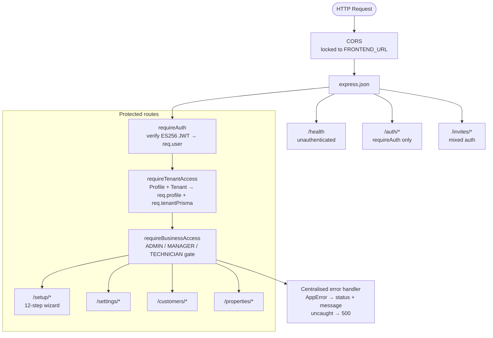
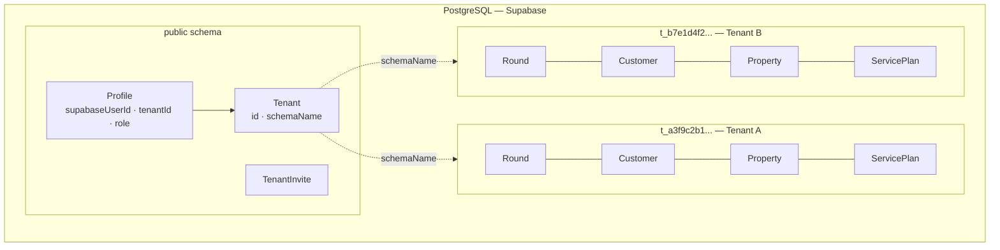
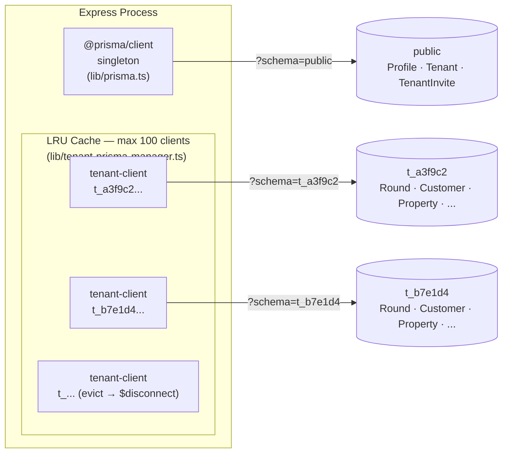
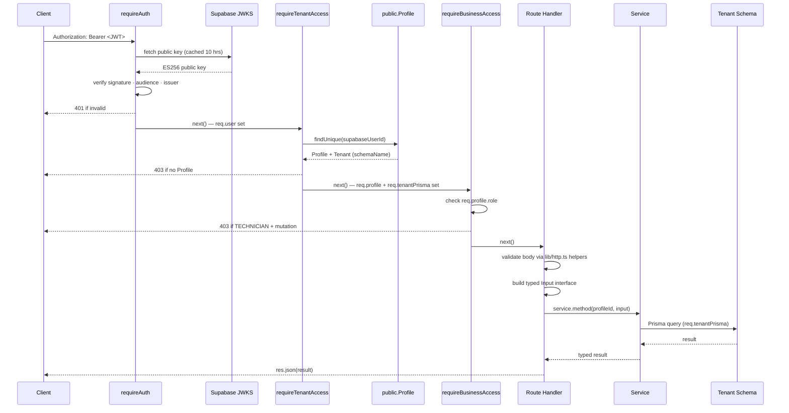
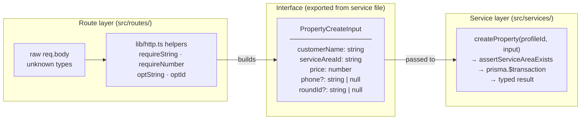
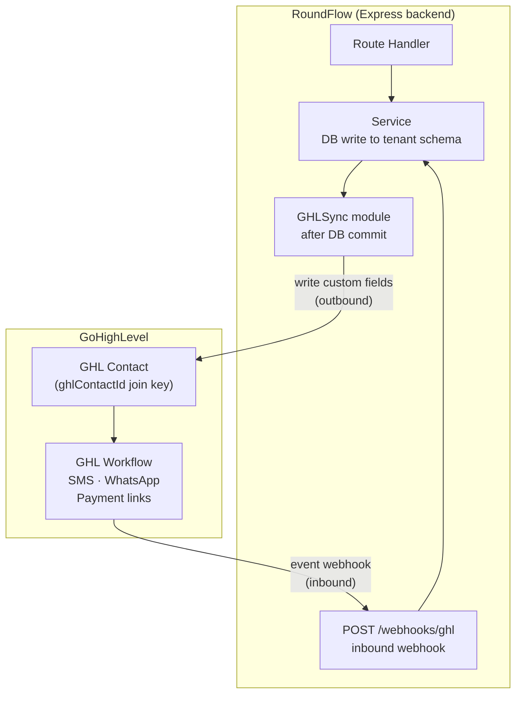
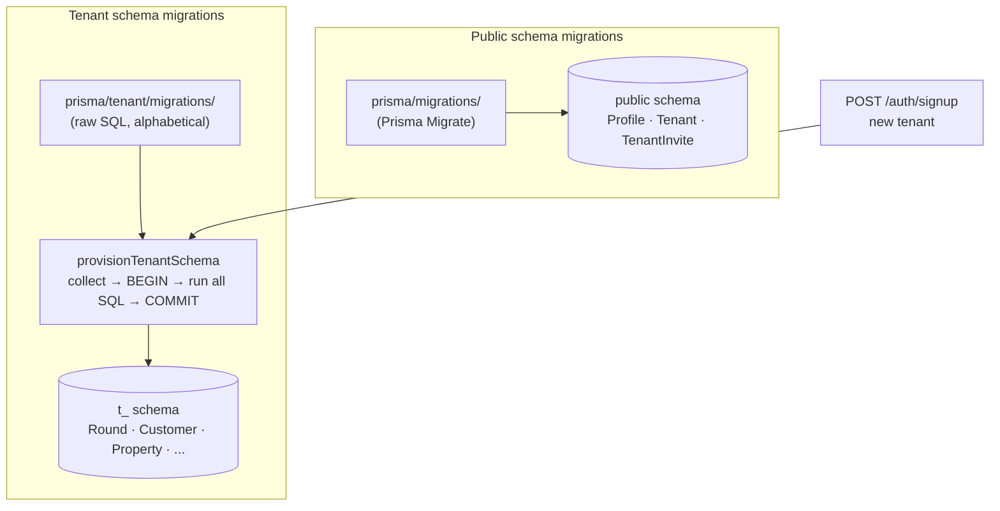

# RoundFlow Backend Architecture

## 1. Overview

RoundFlow is a multi-tenant SaaS backend for UK window-cleaning businesses. Each business (tenant) operates in complete isolation — they share the same Express/TypeScript process and the same PostgreSQL instance, but their operational data lives in a dedicated Postgres schema. The backend is deployed on Railway and communicates with a React frontend; it has no HTML rendering concerns.

---

## 2. Technology Stack

| Layer | Technology |
|---|---|
| Runtime | Node.js (TypeScript, compiled to `dist/`) |
| Framework | Express 4 |
| ORM | Prisma (two separate clients — see §5) |
| Database | PostgreSQL via Supabase (hosted) |
| Identity provider | Supabase Auth (ES256 JWTs, JWKS) |
| Email | Resend (transactional email — invite emails + customer-facing templated emails) |
| Deployment | Railway |
| API docs | Swagger UI (`/docs`) |

---

## 3. High-Level Structure



---

## 4. Multi-Tenancy: Schema-Per-Tenant

### The model

Every tenant gets their own Postgres schema named `t_<20-hex-chars>` (e.g. `t_a3f9c2b1...`). All operational tables — `Round`, `Customer`, `Property`, `ServicePlan`, `Visit`, `Technician`, `ServiceArea`, etc. — live inside that schema. Tenants cannot see or touch each other's data at the database level.

The `public` schema holds only three cross-tenant tables: `Profile`, `Tenant`, and `TenantInvite`. These are managed by `@prisma/client` (the public-schema Prisma client singleton).



### Provisioning

When a new business signs up via `POST /auth/signup`:

1. A `Tenant` row is created in `public.Tenant` with a randomly generated `schemaName`.
2. A `Profile` row is created in `public.Profile` linking the Supabase user ID to the tenant.
3. `provisionTenantSchema(schemaName)` is called — it opens a **direct pg connection** (non-pooled), creates the Postgres schema, then runs all tenant migration SQL files inside a single `BEGIN`/`COMMIT` block. If anything fails the transaction rolls back, leaving the schema empty and retryable.

The provisioning function is idempotent: if `BusinessSettings` (the last table in the migration sequence) already exists, it returns immediately without touching anything.

### Isolation guarantee

No tenant data ever touches the public schema. No public-schema query ever touches a tenant schema. The two Prisma clients (§5) enforce this boundary in code.

---

## 5. Two Prisma Clients

This is the most important architectural detail to understand.

### Client 1 — `@prisma/client` (public schema singleton)

```
src/lib/prisma.ts  →  import { PrismaClient } from "@prisma/client"
```

- Talks to the `public` schema only.
- Single global instance shared across the whole process.
- Used by: `requireTenantAccess` (loads Profile + Tenant), `requireAuth` indirectly, invite routes, auth routes.
- Models: `Profile`, `Tenant`, `TenantInvite`.

### Client 2 — `src/generated/tenant-client` (LRU pool)

```
src/lib/tenant-prisma-manager.ts  →  import { PrismaClient } from "../generated/tenant-client"
```

- Talks to a specific tenant schema, set via `?schema=t_<hex>` on the connection string.
- Not a singleton — one `PrismaClient` instance per active tenant schema, cached in an LRU cache (max 100).
- When a tenant client is evicted from the LRU, `$disconnect()` is called immediately to release its connection pool back to Postgres.
- `getTenantPrismaForSchema(schemaName)` returns the cached client or constructs a new one.
- Used by: all service classes (customer, setup, settings).
- Models: everything operational — `Round`, `Customer`, `Property`, `ServicePlan`, `Visit`, `Technician`, `ServiceArea`, `BusinessSettings`, `RoundTechnician`, etc.

### Why two separate generated clients?

Prisma generates type-safe models from a schema file. Because the public schema and tenant schema have completely different tables, they need separate `schema.prisma` files and therefore separate generated clients. Mixing them in a single client would either break the schema isolation or require complex Prisma multi-schema workarounds.

```
prisma/schema.prisma               →  generates @prisma/client
prisma/tenant/schema.prisma        →  generates src/generated/tenant-client
```



---

## 6. Request Lifecycle

A typical authenticated request (e.g. `GET /customers`) flows through:



---

## 7. Auth & RBAC

### Identity (authentication)

Supabase Auth is the identity provider. It handles signup UI, login, OAuth (Google), password reset, and JWT issuance. The backend never stores passwords or manages sessions — it only verifies JWTs.

`requireAuth` fetches Supabase's JWKS endpoint (keys cached 10 hours) and verifies every Bearer token with `jsonwebtoken`. The verification checks:
- Signature (ES256)
- Algorithm (ES256 only — no HS256 downgrade)
- Audience (`"authenticated"`)
- Issuer (the exact Supabase project URL)

Tokens from other Supabase projects cannot be replayed against this API.

### Authorisation (RBAC)

The JWT carries no app role — the Supabase `role` claim is always `"authenticated"` and is ignored. App roles live in `public.Profile.role` and are read from the database on every request by `requireTenantAccess`.

Three roles:

| Role | Can do |
|---|---|
| ADMIN | Everything |
| MANAGER | Everything |
| TECHNICIAN | Read-only (all mutations → 403) |

Role changes take effect on the very next request — no token refresh required, no stale state.


---

## 8. The Route → Interface → Service Pattern

This is how the layers are decoupled.

### The problem it solves

Routes know about HTTP (headers, body, status codes). Services know about the database. Neither should know about the other's concerns. The interface is the contract between them.



### How it works in practice

**Step 1 — Route validates and builds an Input interface:**

```typescript
// src/routes/properties.ts
const input: PropertyCreateInput = {
  customerName: requireString(body.customerName, "customerName"),
  addressLine:  requireString(body.addressLine, "addressLine"),
  serviceAreaId: requireString(body.serviceAreaId, "serviceAreaId"),
  price:        assertPositive(requireNumber(body.price, "price"), "price"),
  // ...
};
res.status(201).json(await svc(req).createProperty(actorIdOf(req), input));
```

**Step 2 — Interface is defined in the service file (exported):**

```typescript
// src/services/customer.service.ts
export interface PropertyCreateInput {
  customerName: string;
  addressLine:  string;
  serviceAreaId: string;      // required — every property must have a service area
  price:        number;
  phone?:       string | null;
  roundId?:     string | null;
  // ...
}
```

**Step 3 — Service method takes the interface, talks to the DB:**

```typescript
async createProperty(profileId: string, input: PropertyCreateInput): Promise<{ ... }> {
  await this.assertServiceAreaExists(input.serviceAreaId);
  return this.prisma.$transaction(async (tx) => {
    const customer = await tx.customer.create({ data: { name: input.customerName, ... } });
    const property = await tx.property.create({ data: { serviceAreaId: input.serviceAreaId, ... } });
    // ...
  });
}
```

### Why this matters

- **Validation happens exactly once**, at the HTTP boundary. The service receives clean, typed data and never has to handle raw `unknown` values.
- **The interface is the contract**. If you make `serviceAreaId` required in the interface, TypeScript will immediately flag every route that doesn't supply it — the compiler enforces the invariant.
- **Services are independently testable**. You can call a service method with a mock Prisma client without touching Express at all.
- **Optional vs required is explicit**. `?: string | null` means the caller may omit it. `string` means it must be there. This is enforced at compile time, not at runtime by surprise.

### The `lib/http.ts` helpers

All input coercion goes through a shared set of helpers:

| Helper | Use case |
|---|---|
| `requireString(v, field)` | Field is mandatory and must be a non-empty string |
| `requireNumber(v, field)` | Field is mandatory and must be a finite number |
| `optString(v, field)` | Optional string; `undefined` = omitted, `null` = clear |
| `optId(v, field)` | Optional FK id; empty string treated as null |
| `optReqString(v, field)` | Present if provided but must be non-empty |
| `asObject(body)` | Asserts body is a JSON object, not array or primitive |
| `asArray(body, key)` | Accepts raw array or `{ key: [...] }` wrapper |

Every helper throws `AppError(400, ...)` on failure, which the centralised error handler converts to a `{ error: "..." }` JSON response.

---

## 9. Error Handling

`AppError` is the single typed error class:

```typescript
class AppError extends Error {
  constructor(public statusCode: number, message: string) { ... }
}
```

Any service or route can `throw new AppError(404, "Round not found")`. The centralised handler in `src/index.ts` catches it and responds with the correct status + message. Untyped errors (unexpected exceptions) become 500s and are logged.

This means service code never touches `res` — it throws, the route handler propagates via `next(err)`, and the handler decides the HTTP response.

---

## 10. GHL Two-Way Sync (Planned)

### What GHL is in RoundFlow

GHL (GoHighLevel) is a **utility**, not the platform. RoundFlow does not run inside GHL. GHL is used for:
- **Outbound messaging** to customers: SMS, WhatsApp (sent via GHL's messaging infrastructure). **Email** is sent directly via **Resend** (not GHL) — see `src/lib/email.ts`.
- **Payment flow assistance**: GoCardless and Stripe payment links surfaced through GHL workflows

A single GHL account serves all RoundFlow tenants (not one GHL sub-account per tenant). Every `Customer` and `Property` record carries a `ghlContactId` column from day one, which is the join key between RoundFlow and GHL.

### The sync model

The two-way sync works on the GHL **Contact** as the shared entity. Every `Customer` and `Property` in RoundFlow carries a `ghlContactId` column — this is the join key between the two systems.



**RoundFlow → GHL (outbound)**

When RoundFlow data changes (visit completed, payment collected, round scheduled), RoundFlow writes the relevant fields to the GHL Contact. This keeps GHL up to date so its workflows (SMS reminders, payment chase sequences) fire on accurate data.

**GHL → RoundFlow (inbound)**

When a customer responds or a payment status changes inside GHL, RoundFlow needs to know. Two approaches are under consideration (DP-GHL, unresolved):

| Option | Mechanism | Trade-offs |
|---|---|---|
| A — Field-watch | Write a value to a GHL Contact custom field; a GHL Workflow watches for the change and fires a webhook to RoundFlow | No direct API call from RoundFlow; GHL orchestrates the trigger; harder to test |
| B — Direct API | RoundFlow calls the GHL API directly when it needs to push/pull state | Simpler data flow; requires GHL API credentials per-request; RoundFlow owns the sync timing |

### Where it plugs into the existing architecture

The GHL layer will sit alongside the service layer, not inside it. Services remain pure DB operations. A separate GHL integration module will:

1. Be called by route handlers or a background job after a service operation completes.
2. Use `ghlContactId` on the Customer/Property to identify the GHL Contact.
3. Read/write GHL Contact custom fields via the GHL API.
4. On inbound webhooks from GHL, call the appropriate service method to update RoundFlow state.

### What is already in place

- `ghlContactId` column exists on `Customer` and `Property` from the initial schema — the join key is wired in before GHL integration code is written.
- The service layer's interface pattern means GHL sync can be added without modifying service internals — it composes on top.
- The trigger mechanism (DP-GHL) and detailed field mapping are deferred decisions.

---

## 11. Setup Wizard and Post-Setup Split

The backend enforces a strict split between setup-time and runtime operations:

- `/setup/*` — only callable during setup (`setupCompleted = false`). A `assertSetupIncomplete` guard returns 403 once the wizard is complete.
- `/customers/*`, `/properties/*`, `/settings/*` — runtime routes, always available post-setup.

This prevents accidental re-configuration of a live tenant through the wizard endpoints and keeps the two concerns (onboarding vs operations) cleanly separated at the route level.

---

## 12. Migrations

Two migration trees, completely separate:

| Tree | Location | Managed by | Applies to |
|---|---|---|---|
| Public schema | `prisma/migrations/` | Prisma Migrate | `Profile`, `Tenant`, `TenantInvite` |
| Tenant schema | `prisma/tenant/migrations/` | `provisionTenantSchema` (replayed in order) | All operational tables |



Tenant migrations are replayed every time a new tenant schema is provisioned. They are **not** run via `prisma migrate` — they are collected alphabetically and executed as raw SQL inside a transaction by `provisionTenantSchema`. This means every new tenant always gets the full current schema from day one.

Existing tenant schemas are **not** automatically migrated when a new migration is added (that is a Phase 2 concern requiring a migration runner that iterates all `Tenant.schemaName` values and applies pending SQL).
