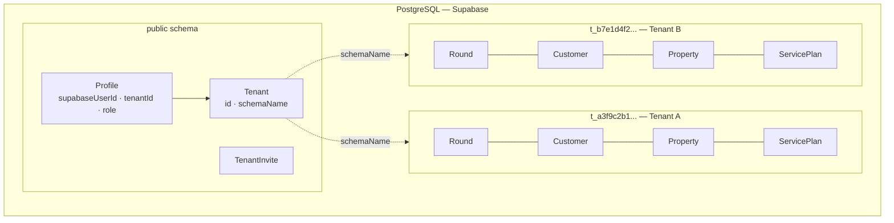
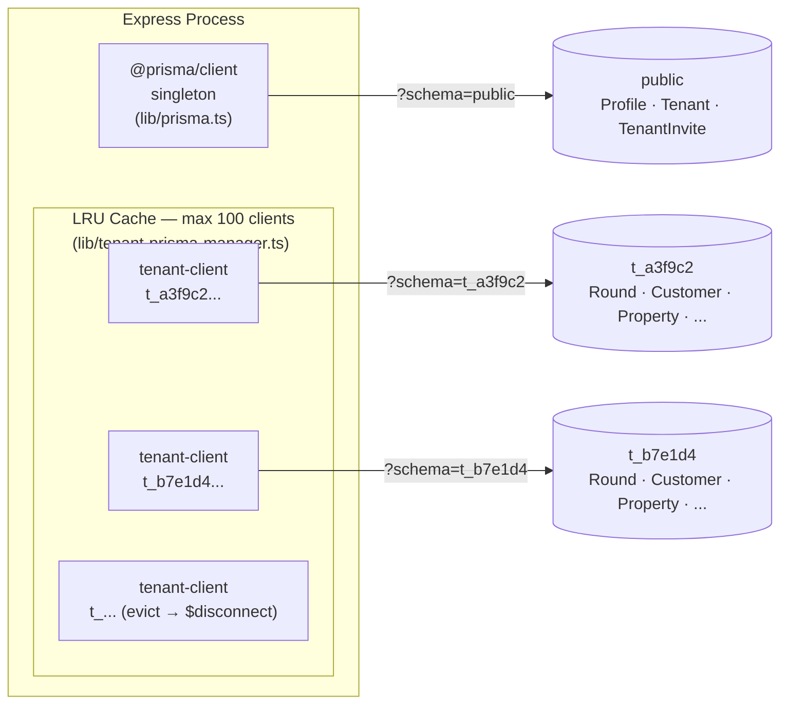
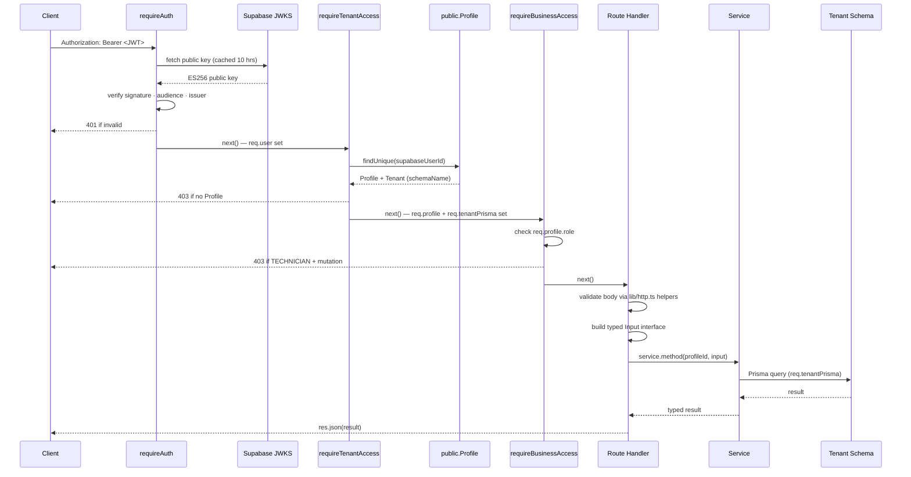
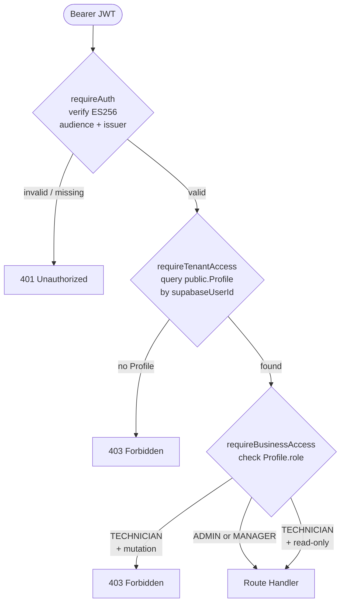
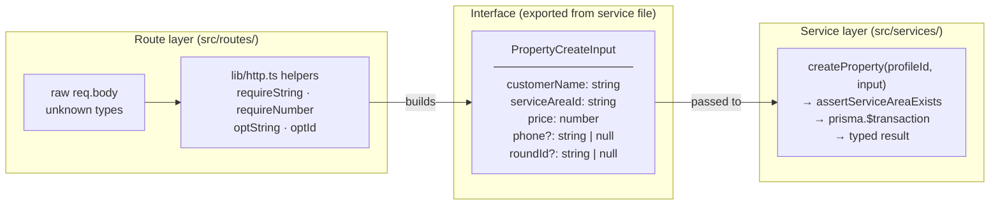
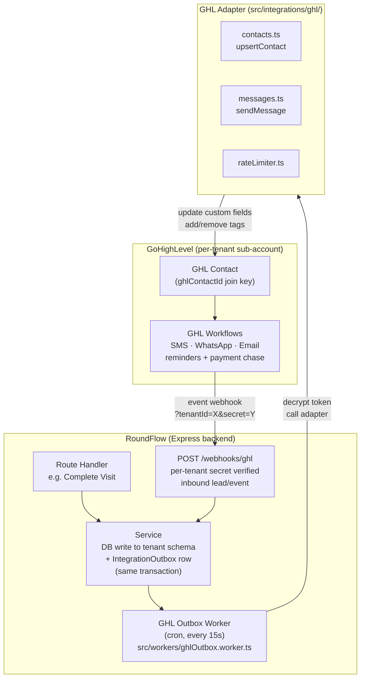
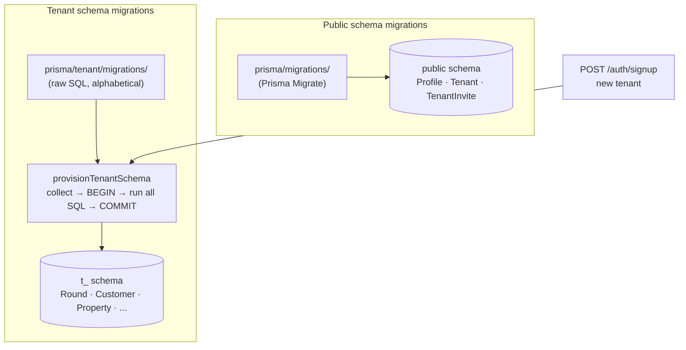

# RoundFlow Backend Architecture

## 1. Overview

RoundFlow is a multi-tenant SaaS backend for UK window-cleaning businesses. Each business (tenant) operates in complete isolation — they share the same Express/TypeScript process and the same PostgreSQL instance, but their operational data lives in a dedicated Postgres schema. The backend is deployed on Railway and communicates with a React frontend; it has no HTML rendering concerns.

**Phase 1 target:** GHL-connected clients only. RoundFlow is sold as a private integration to businesses already on Agentum's GoHighLevel agency — not listed on the GHL Marketplace yet. GHL connection is required in Phase 1; marketplace listing and standalone mode are Phase 2.

**Standalone capability:** The core app (rounds, visits, payments, debt, technicians) works without a GHL connection. The only features that require GHL are SMS, WhatsApp, and email messaging. GoCardless payments work standalone.

---

## 2. Technology Stack

| Layer | Technology |
|---|---|
| Runtime | Node.js (TypeScript, compiled to `dist/`) |
| Framework | Express 4 |
| ORM | Prisma (two separate clients — see §5) |
| Database | PostgreSQL via Supabase (hosted) |
| Identity provider | Supabase Auth (ES256 JWTs, JWKS) |
| Staff invite email | Supabase Auth (`admin.auth.inviteUserByEmail`) — same infrastructure as OTP + password reset |
| Customer-facing email | GHL (same as SMS/WhatsApp — all customer comms route through GHL outbox) |
| Deployment | Railway |
| API docs | Swagger UI (`/docs`) |

---

## 3. High-Level Structure


---

## 4. Multi-Tenancy: Schema-Per-Tenant

### The model

Every tenant gets their own Postgres schema named `t_<20-hex-chars>` (e.g. `t_a3f9c2b1...`). All operational tables — `Round`, `Customer`, `Property`, `ServicePlan`, `Visit`, `Technician`, `ServiceArea`, etc. — live inside that schema. Tenants cannot see or touch each other's data at the database level.

The `public` schema holds only three cross-tenant tables: `Profile`, `Tenant`, and `TenantInvite`. These are managed by `@prisma/client` (the public-schema Prisma client singleton).



### Provisioning

When a new business signs up via `POST /auth/signup`:

1. A `Tenant` row is created in `public.Tenant` with a randomly generated `schemaName`.
2. A `Profile` row is created in `public.Profile` linking the Supabase user ID to the tenant.
3. `provisionTenantSchema(schemaName)` is called — it opens a **direct pg connection** (non-pooled), creates the Postgres schema, then runs all tenant migration SQL files inside a single `BEGIN`/`COMMIT` block. If anything fails the transaction rolls back, leaving the schema empty and retryable.

The provisioning function is idempotent: if `BusinessSettings` (the last table in the migration sequence) already exists, it returns immediately without touching anything.

### Isolation guarantee

No tenant data ever touches the public schema. No public-schema query ever touches a tenant schema. The two Prisma clients (§5) enforce this boundary in code.

---

## 5. Two Prisma Clients

This is the most important architectural detail to understand.

### Client 1 — `@prisma/client` (public schema singleton)

```
src/lib/prisma.ts  →  import { PrismaClient } from "@prisma/client"
```

- Talks to the `public` schema only.
- Single global instance shared across the whole process.
- Used by: `requireTenantAccess` (loads Profile + Tenant), `requireAuth` indirectly, invite routes, auth routes.
- Models: `Profile`, `Tenant`, `TenantInvite`.

### Client 2 — `src/generated/tenant-client` (LRU pool)

```
src/lib/tenant-prisma-manager.ts  →  import { PrismaClient } from "../generated/tenant-client"
```

- Talks to a specific tenant schema, set via `?schema=t_<hex>` on the connection string.
- Not a singleton — one `PrismaClient` instance per active tenant schema, cached in an LRU cache (max 100).
- When a tenant client is evicted from the LRU, `$disconnect()` is called immediately to release its connection pool back to Postgres.
- `getTenantPrismaForSchema(schemaName)` returns the cached client or constructs a new one.
- Used by: all service classes (customer, setup, settings).
- Models: everything operational — `Round`, `Customer`, `Property`, `ServicePlan`, `Visit`, `Technician`, `ServiceArea`, `BusinessSettings`, `RoundTechnician`, etc.

### Why two separate generated clients?

Prisma generates type-safe models from a schema file. Because the public schema and tenant schema have completely different tables, they need separate `schema.prisma` files and therefore separate generated clients. Mixing them in a single client would either break the schema isolation or require complex Prisma multi-schema workarounds.

```
prisma/schema.prisma               →  generates @prisma/client
prisma/tenant/schema.prisma        →  generates src/generated/tenant-client
```



---

## 6. Request Lifecycle

A typical authenticated request (e.g. `GET /customers`) flows through:



---

## 7. Auth & RBAC

### Identity (authentication)

Supabase Auth is the identity provider. It handles signup UI, login, OAuth (Google), password reset, and JWT issuance. The backend never stores passwords or manages sessions — it only verifies JWTs.

`requireAuth` fetches Supabase's JWKS endpoint (keys cached 10 hours) and verifies every Bearer token with `jsonwebtoken`. The verification checks:
- Signature (ES256)
- Algorithm (ES256 only — no HS256 downgrade)
- Audience (`"authenticated"`)
- Issuer (the exact Supabase project URL)

Tokens from other Supabase projects cannot be replayed against this API.

### Authorisation (RBAC)

The JWT carries no app role — the Supabase `role` claim is always `"authenticated"` and is ignored. App roles live in `public.Profile.role` and are read from the database on every request by `requireTenantAccess`.

Three roles:

| Role | Can do |
|---|---|
| ADMIN | Everything |
| MANAGER | Everything |
| TECHNICIAN | Read-only (all mutations → 403) |

Role changes take effect on the very next request — no token refresh required, no stale state.



---

## 8. The Route → Interface → Service Pattern

This is how the layers are decoupled.

### The problem it solves

Routes know about HTTP (headers, body, status codes). Services know about the database. Neither should know about the other's concerns. The interface is the contract between them.



### How it works in practice

**Step 1 — Route validates and builds an Input interface:**

```typescript
// src/routes/properties.ts
const input: PropertyCreateInput = {
  customerName: requireString(body.customerName, "customerName"),
  addressLine:  requireString(body.addressLine, "addressLine"),
  serviceAreaId: requireString(body.serviceAreaId, "serviceAreaId"),
  price:        assertPositive(requireNumber(body.price, "price"), "price"),
  // ...
};
res.status(201).json(await svc(req).createProperty(actorIdOf(req), input));
```

**Step 2 — Interface is defined in the service file (exported):**

```typescript
// src/services/customer.service.ts
export interface PropertyCreateInput {
  customerName: string;
  addressLine:  string;
  serviceAreaId: string;      // required — every property must have a service area
  price:        number;
  phone?:       string | null;
  roundId?:     string | null;
  // ...
}
```

**Step 3 — Service method takes the interface, talks to the DB:**

```typescript
async createProperty(profileId: string, input: PropertyCreateInput): Promise<{ ... }> {
  await this.assertServiceAreaExists(input.serviceAreaId);
  return this.prisma.$transaction(async (tx) => {
    const customer = await tx.customer.create({ data: { name: input.customerName, ... } });
    const property = await tx.property.create({ data: { serviceAreaId: input.serviceAreaId, ... } });
    // ...
  });
}
```

### Why this matters

- **Validation happens exactly once**, at the HTTP boundary. The service receives clean, typed data and never has to handle raw `unknown` values.
- **The interface is the contract**. If you make `serviceAreaId` required in the interface, TypeScript will immediately flag every route that doesn't supply it — the compiler enforces the invariant.
- **Services are independently testable**. You can call a service method with a mock Prisma client without touching Express at all.
- **Optional vs required is explicit**. `?: string | null` means the caller may omit it. `string` means it must be there. This is enforced at compile time, not at runtime by surprise.

### The `lib/http.ts` helpers

All input coercion goes through a shared set of helpers:

| Helper | Use case |
|---|---|
| `requireString(v, field)` | Field is mandatory and must be a non-empty string |
| `requireNumber(v, field)` | Field is mandatory and must be a finite number |
| `optString(v, field)` | Optional string; `undefined` = omitted, `null` = clear |
| `optId(v, field)` | Optional FK id; empty string treated as null |
| `optReqString(v, field)` | Present if provided but must be non-empty |
| `asObject(body)` | Asserts body is a JSON object, not array or primitive |
| `asArray(body, key)` | Accepts raw array or `{ key: [...] }` wrapper |

Every helper throws `AppError(400, ...)` on failure, which the centralised error handler converts to a `{ error: "..." }` JSON response.

---

## 9. Error Handling

`AppError` is the single typed error class:

```typescript
class AppError extends Error {
  constructor(public statusCode: number, message: string) { ... }
}
```

Any service or route can `throw new AppError(404, "Round not found")`. The centralised handler in `src/index.ts` catches it and responds with the correct status + message. Untyped errors (unexpected exceptions) become 500s and are logged.

This means service code never touches `res` — it throws, the route handler propagates via `next(err)`, and the handler decides the HTTP response.

---

## 10. GHL Integration — Hybrid Architecture

> **Decision made.** Full architecture documented in this section. Automation owner handoff: `docs/GHL_AUTOMATION_OWNER_HANDOFF.md`.

### What GHL is in RoundFlow

GHL (GoHighLevel) is a **utility**, not the platform. RoundFlow does not run inside GHL. GHL handles:
- **All outbound customer communications**: SMS, WhatsApp, and **Email** — reminders, payment chases, job completion notifications, invoice delivery. Configured once as GHL Workflows by the automation owner; fired by RoundFlow-written Contact fields/tags via the outbox worker.
- **Inbound lead capture**: new leads tagged `ready-for-roundflow` in GHL are posted to RoundFlow via webhook, automatically creating `Customer` + `Property` records.

**Staff / internal email** (invite links, onboarding) uses **Supabase Auth** (`admin.auth.inviteUserByEmail()`) — the same infrastructure that sends OTP and password reset emails. Resend has been removed from the stack entirely.

**One GHL sub-account per tenant** — each business (tenant) has its own GHL location. `Tenant.ghlLocationId` is the unique identifier; tokens are stored per-tenant, encrypted at rest.

### Ownership boundary

| Domain | System |
|---|---|
| Customers, Properties, Rounds, Visits, Payments, Debt, Technicians | **RoundFlow** (system of record — always) |
| SMS / WhatsApp / Email delivery, lead capture, marketing sequences | **GHL** |
| GoCardless Direct Debit mandates + charges | **RoundFlow backend** (GoCardless SDK — charge creation, mandate setup, webhook receiver) |
| Stripe card fallback link generation | RoundFlow generates, GHL delivers |

RoundFlow **never** treats GHL as a database. Every write happens in RoundFlow Postgres first; GHL is told about it afterward via the outbox.

### Architecture: Outbox Pattern

Route handlers and service methods do **not** call GHL directly. Instead, they write an `IntegrationOutbox` row in the same transaction as the operational write. A background worker drains the outbox and calls the GHL Adapter.



### Planned schema additions (not yet in code — part of GHL integration work)

**Public schema `Tenant` model** gains:

```
ghlLocationId       String?  @unique
ghlCredentialType   GhlCredentialType?   // PIT | OAUTH
ghlAccessToken      String?              // AES-256-GCM encrypted
ghlRefreshToken     String?              // null for PIT
ghlTokenExpiresAt   DateTime?
ghlConnectionStatus GhlConnectionStatus? // CONNECTED | DISCONNECTED | ERROR
ghlWebhookSecret    String?              // per-tenant, encrypted
ghlConnectedAt      DateTime?
ghlLastSyncError    String?
```

**Tenant schema** gains two new models:

- `IntegrationOutbox` — queued outbound events (`visit.completed`, `payment.collected`, `debt.overdue`, `complaint.logged`, `round.scheduled`) with status `pending | sent | failed | dead`.
- `WebhookEvent` — inbound event dedup table with `@@unique([source, externalId])`.

**`Message` model** gains `ghlMessageId String?` and `ghlConversationId String?` to store GHL's response IDs.

### New endpoints (part of GHL integration work)

| Endpoint | Method | Purpose |
|---|---|---|
| `/settings/ghl/connect` | POST | Validate PIT token + locationId, store encrypted, set status CONNECTED |
| `/settings/ghl/status` | GET | Return connection status + last sync error (never the token) |
| `/settings/ghl/disconnect` | POST | Clear token, set status DISCONNECTED |
| `/webhooks/ghl` | POST | Receive inbound GHL events; verify per-tenant secret; ack 200 immediately, process async |

### GoCardless (RoundFlow backend — full SDK integration)

GoCardless runs entirely in RoundFlow using the GoCardless SDK. GHL is not involved in payment processing.

1. **Mandate setup** — GoCardless Billing Request Flow (hosted redirect) during Setup Wizard Step 2.
2. **Webhook receiver** — `POST /webhooks/gocardless` (HMAC signature verification per GoCardless scheme). Handles `mandate_active`, `payment_confirmed`, `payment_failed`.
3. **Charge creation** — triggered at `visit.completed`, same transaction moment as the GHL outbox row write. Independent side-effects, not coupled.
4. On `payment_confirmed` → record `Payment` row + write `payment.collected` outbox event → GHL removes `debt-overdue` tag, updates `balance_owed`.
5. On `payment_failed` → write `payment.failed` outbox event → GHL adds `payment-failed` tag → GHL chase sequence fires.

**Outbox event types for GoCardless:**

| Event | When written | GHL action |
|---|---|---|
| `payment.collected` | `payment_confirmed` webhook received | Remove `debt-overdue` tag, update `balance_owed` |
| `payment.failed` | `payment_failed` webhook received | Add `payment-failed` tag → triggers GHL chase sequence |

**Customer-facing confirmation message** (sent by GHL Workflow on `payment.collected`):
> "Your payment of £XX is being collected by Direct Debit and will leave your account within 3 working days."

**Balance computation** — `Customer.balanceOwed` is **not** a stored field. Compute at outbox-write time: `SUM(Invoice.amount WHERE status != CANCELLED) − SUM(Payment.amount WHERE status = CONFIRMED)`. Embed in `IntegrationOutbox.payload`. Never store a denormalised balance on the Customer row.

> **⚠️ DEPLOY BLOCKER — GoCardless is currently live via Zapier for Mark.** The Zapier GoCardless flow must be **disabled at the same moment** RoundFlow's GoCardless webhook goes live. Running both simultaneously will double-charge customers. Coordinate directly with Mark for an explicit cutover — disable Zapier, enable RoundFlow webhook, monitor for 48 hours.

---

## 11. Setup Wizard and Post-Setup Split

The backend enforces a strict split between setup-time and runtime operations:

- `/setup/*` — only callable during setup (`setupCompleted = false`). A `assertSetupIncomplete` guard returns 403 once the wizard is complete.
- `/customers/*`, `/properties/*`, `/settings/*` — runtime routes, always available post-setup.

This prevents accidental re-configuration of a live tenant through the wizard endpoints and keeps the two concerns (onboarding vs operations) cleanly separated at the route level.

---

## 12. Migrations

Two migration trees, completely separate:

| Tree | Location | Managed by | Applies to |
|---|---|---|---|
| Public schema | `prisma/migrations/` | Prisma Migrate | `Profile`, `Tenant`, `TenantInvite` |
| Tenant schema | `prisma/tenant/migrations/` | `provisionTenantSchema` (replayed in order) | All operational tables |



Tenant migrations are replayed every time a new tenant schema is provisioned. They are **not** run via `prisma migrate` — they are collected alphabetically and executed as raw SQL inside a transaction by `provisionTenantSchema`. This means every new tenant always gets the full current schema from day one.

Existing tenant schemas are **not** automatically migrated when a new migration is added (that is a Phase 2 concern requiring a migration runner that iterates all `Tenant.schemaName` values and applies pending SQL).

### Current tenant migration log

| Migration | Purpose |
|---|---|
| `20260721000001_init_tenant` | Full initial tenant schema — all operational models + enums. |
| `20260721000002_business_settings_unique_id` | Adds `BusinessSettings.uniqueId @unique @default("singleton")` — DB-enforced singleton. |
| `20260721000003_setup_steps_9_12` | `PropertyType` enum; `Property.propertyType`; `ServicePlan.cleaningFrequency`; `RoundTechnician` join table. |
| `20260726000000_message_template_subject` | Adds `MessageTemplate.subject String?` for email subject lines. |
| `20260728000000_service_area_single_default_index` | Partial unique index — one default `ServiceArea` per tenant. |
| `20260805000000_business_settings_last_closed_date` | Adds `BusinessSettings.lastClosedDate DateTime?`. |
| `20260805000001_technician_email_notes` | Adds `Technician.email String?` and `Technician.notes String?`. |
| `20260812000000_invoice_due_date` | Adds `Invoice.dueDate DateTime?`. |
| `20260812000001_customer_hold_next_clean` | Adds `Customer.holdNextClean Boolean @default(false)`. |
| `20260812000002_activity_log_actor` | Adds `ActivityLog.actorId String?`. |
| `20260825000000_cleaning_frequency_4_6_8_12` | Extends `CleaningFrequency` enum values. |
| `20260825000001_business_settings_pre_clean_reminder_timings` | Pre-clean reminder timing config on `BusinessSettings`. |
| `20260825000002_customer_landline` | Adds `Customer.landline String?`. |
| `20260915000000_technician_emergency` | `EmergencyStatus` enum + `TechnicianEmergency` model; emergency relations on `Technician` and `Round`. |
